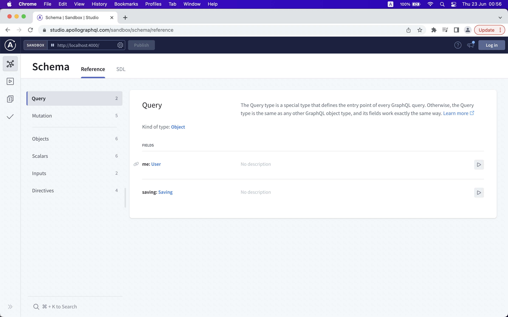
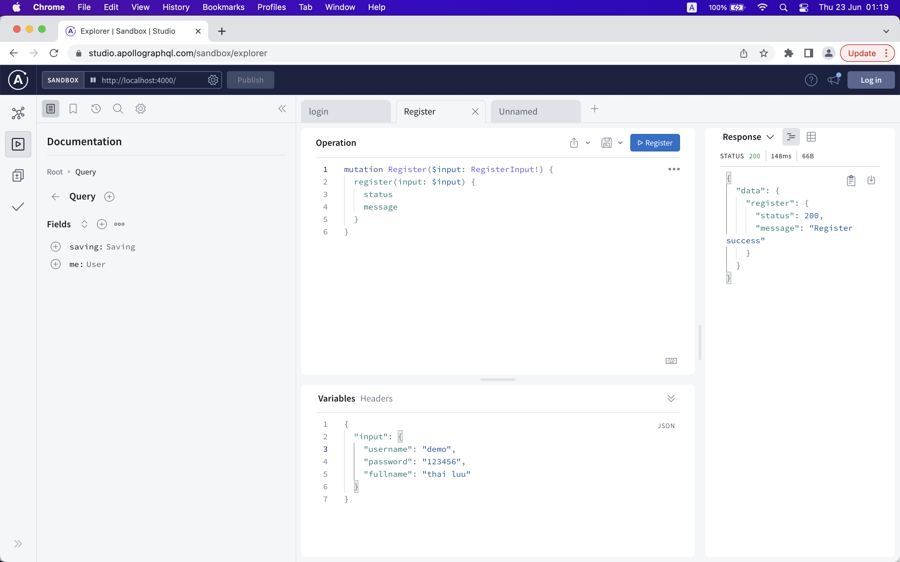
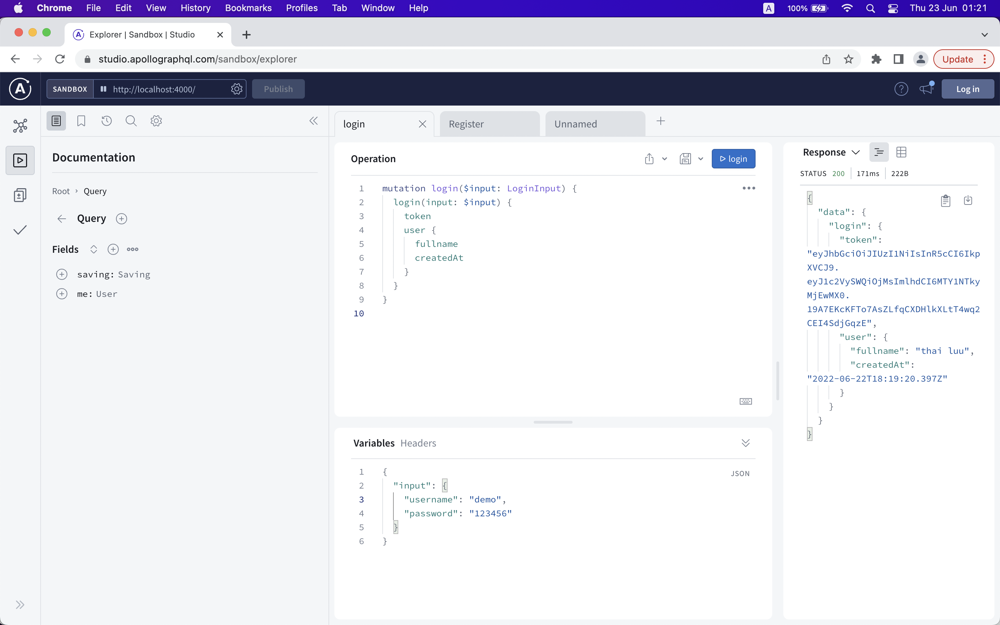
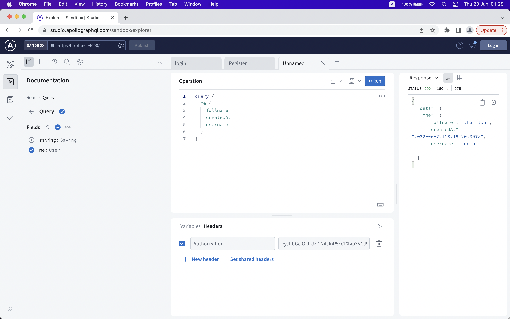
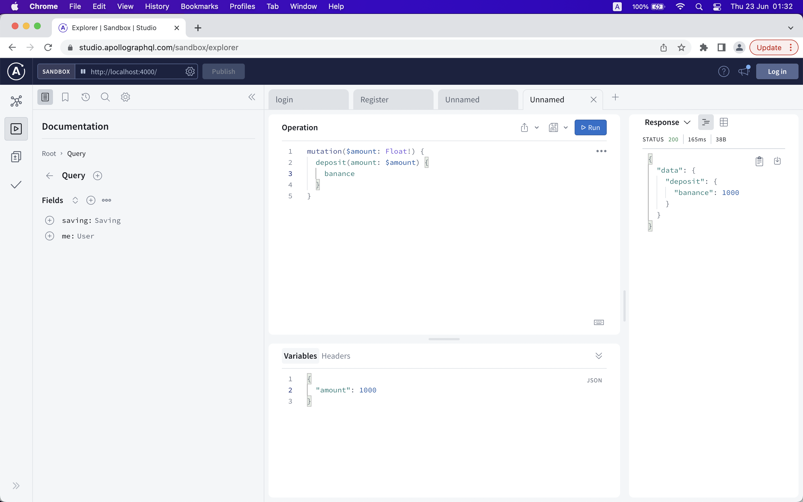
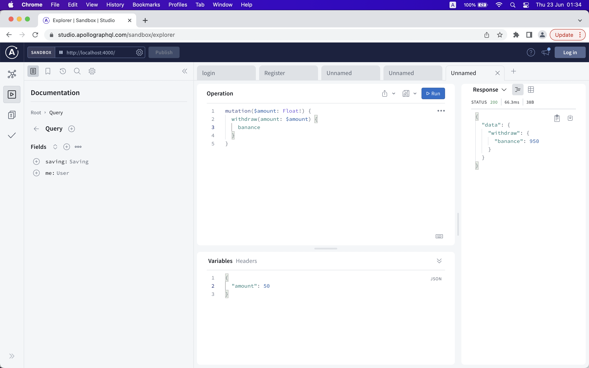
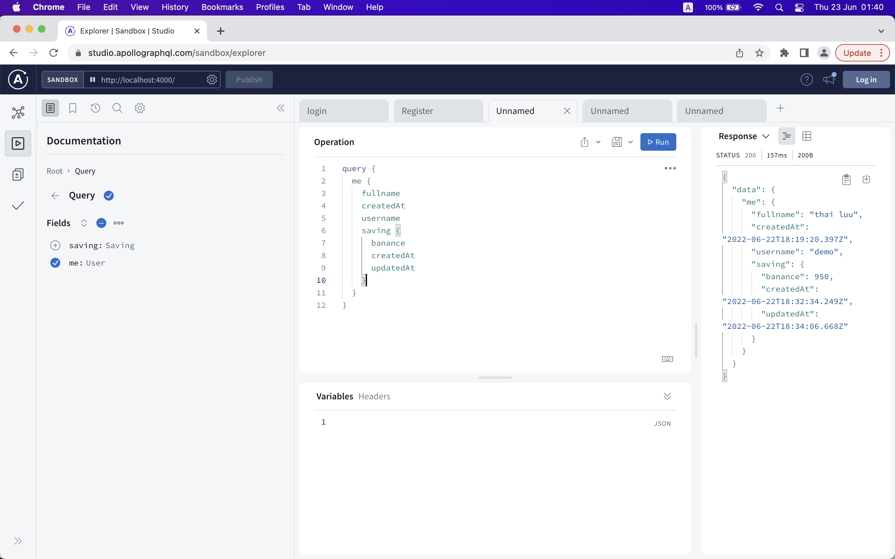
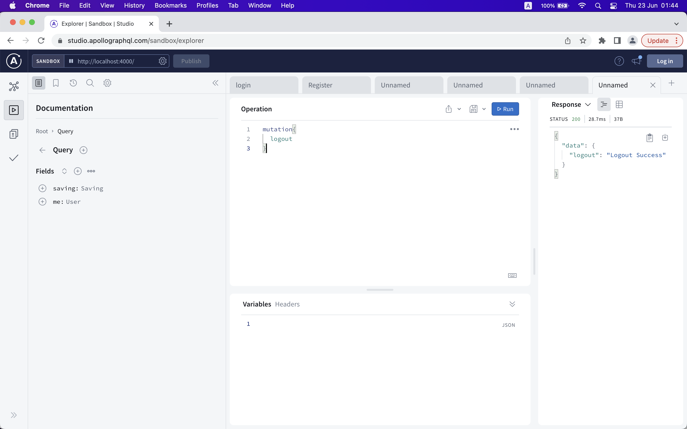

# Getting Started

Technicals:
- Graphql: Apollo-Server, Federation(v2)
- Database: Postgres (using Docker)
- ORM: using Prisma
- authen: using token (jswebtoken)
- Type: Typescript

Demo have three service:
- gateway:  a unified supergraph that combines User-Serive (graphql api) and Savings-Service (graphql api) and check authen token
- User-Service: 
- Saving-Service
## How to use


### 1. Download demo

Clone this repository:

```
git clone https://github.com/xuanthai/Infina-Project.git
```

Install npm dependencies:

```
cd prisma-examples/databases/mongodb
npm install
```

### 2. Start Postgres with Docker Compose

Run the following command to start MongoDB:

```
docker compose up -d
```
> **Note:** The `docker-compose.yml` is where the root username and password are set with the `POSTGRES_USER` `POSTGRES_PASSWORD` env vars

### 3. Install Dependencies And Setup
User-Service:

```
cd User-Service
npm install
npm run setup
npm run start
```

Savings-Service:

```
cd Savings-Service
npm install
npm run setup
npm run start
```

gateway:

```
cd gateway
npm install
npm run setup

rover supergraph compose --config ./supergraph-config.yaml > supergraph.graphql
npm run start
```
> **Note:** if exist file supergraph.graphql then skip run 'rover supergraph compose --config ./supergraph-config.yaml > supergraph.graphql'


### 4. Test Method On Browser (chome)

open chrome and past link: http://localhost:4000 to view schema and run Query/Mutation




Register


Login


Get info of user current


Deposite


WithDraw


Show User + Saving with federation


Logout: demo using blacklist contain toke, product using redis



### 5. Savings interest is calculated

we are using cron job or push to Queue(rabitmq, redis queue) to compute

### 6. Scalability

I recommend on dedicate server

Using cached:
- Redis
- Dataloader

Cluster service
- PM2 or node cluster

Nginx:
- Loadbanance + HAProxy (keep alive)

Database:
- Postgres/Mongo/Redis setup cluster

